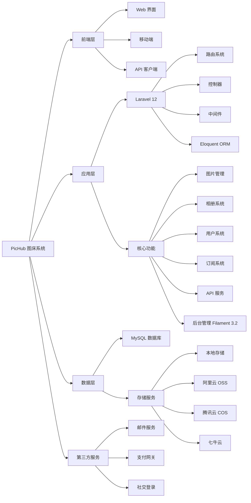

<table>
<tr>
<td width="50%" align="center" valign="middle">


# PicHub - 专业的图片托管与管理平台

[在线演示](https://pichub.app) · [问题反馈](https://github.com/truman-world/PicHub/issues)

</td>
<td width="50%" valign="top">

**后端技术**

[](https://laravel.com)
[](https://php.net)
[](https://mysql.com)
[](https://filamentphp.com)

**前端技术**

[](https://tailwindcss.com)
[](https://alpinejs.dev)
[](https://vitejs.dev)
[](https://laravel.com/docs/blade)

**存储支持**

[]()
[](https://aliyun.com/product/oss)
[](https://cloud.tencent.com/product/cos)
[](https://qiniu.com)

**核心特性**

[]()
[]()
[]()
[]()

</td>
</tr>
</table>

---

## 核心优势

<table>
<tr>
<td width="25%" align="center">

### 简单易用

直观的界面设计，拖拽上传，批量管理，零学习成本快速上手。

</td>
<td width="25%" align="center">

### 功能完善

相册管理、图片处理、多格式支持、API 接口，满足各类需求。

</td>
<td width="25%" align="center">

### 灵活存储

支持本地存储和多种云存储服务，自由选择最适合的方案。

</td>
<td width="25%" align="center">

### 多语言

内置中英法俄四种语言，支持深色模式，提供更好的用户体验。

</td>
</tr>
</table>

---

## 核心功能

### 图片管理

- **多格式上传** - 支持 JPEG、PNG、WebP、GIF 等主流图片格式
- **批量上传** - 拖拽上传、粘贴上传、批量处理
- **图片处理** - 基于 Intervention Image 的图片压缩、格式转换、缩略图生成
- **图片服务** - 优化的图片访问路径 `/img/{path}`，支持 CDN 加速
- **图片广场** - 公开图片展示、瀑布流布局、无限滚动加载
- **图片详情** - 完整的图片信息展示、点赞收藏、社交分享（Open Graph、Twitter Cards）
- **我的图库** - 个人图片管理、批量操作、快速筛选

### 相册系统

- **相册创建** - 创建、编辑、删除相册，自定义封面
- **图片组织** - 批量添加/移除图片、拖拽排序
- **权限控制** - 公开/私有相册，访问权限管理
- **相册分享** - 公开相册链接、SEO 优化（动态标题、描述）
- **用户相册** - 查看其他用户的公开相册
- **批量管理** - 批量删除相册、批量操作图片

### 存储引擎

- **本地存储** - 默认本地文件系统存储，适合小规模部署
- **阿里云 OSS** - 支持阿里云对象存储服务
- **腾讯云 COS** - 支持腾讯云对象存储服务
- **七牛云** - 支持七牛云存储服务
- **灵活配置** - 后台管理面板配置存储提供商
- **存储统计** - 存储空间使用统计、流量监控

### 用户系统

- **用户认证** - 注册、登录、邮箱验证、密码重置
- **社交登录** - 支持第三方社交账号登录（Laravel Socialite）
- **个人资料** - 头像上传、个人信息编辑、账号设置
- **用户主页** - 公开的用户主页，展示用户图片和相册
- **点赞收藏** - 图片点赞功能、收藏列表管理
- **浏览历史** - 图片浏览历史记录
- **API 密钥** - 生成和管理 API 访问令牌

### 订阅系统

- **套餐管理** - 多种订阅套餐（免费、基础、专业、企业）
- **优惠券** - 优惠券创建、验证、使用
- **支付集成** - 支付网关集成、订单管理
- **配额控制** - 存储空间、流量、上传次数限制
- **订阅历史** - 订阅记录、续费管理、取消订阅
- **定价页面** - 动态定价展示、套餐对比

### API 接口

- **RESTful API** - 完整的图片上传、管理、删除接口
- **API 文档** - 内置 API 文档页面 `/api-docs`，详细的接口说明和示例
- **Token 认证** - 基于 Laravel Sanctum 的 API 认证
- **批量操作** - 支持批量上传、批量删除等操作
- **Webhook** - Webhook 管理、事件通知

### 后台管理

- **Filament 面板** - 基于 Filament 3.2 的强大后台管理系统
- **用户管理** - 用户列表、权限管理、账号状态控制
- **图片管理** - 图片审核、批量操作、存储统计
- **相册管理** - 相册审核、权限设置
- **订单管理** - 订单查看、支付状态跟踪
- **套餐管理** - 套餐配置、价格设置
- **优惠券管理** - 优惠券创建、使用统计
- **支付网关** - 支付方式配置、支付记录
- **存储配置** - 存储提供商配置、存储统计
- **API 密钥** - API 密钥管理、权限控制
- **公告管理** - 系统公告发布、通知管理
- **工单系统** - 用户工单处理、客服支持
- **页面管理** - 自定义页面（隐私政策、服务条款等）

### 其他功能

- **多语言** - 内置中文、英文、法语、俄语四种语言
- **深色模式** - 完整的深色主题支持
- **响应式设计** - 完美适配桌面端和移动端
- **SEO 优化** - 动态 Meta 标签、Open Graph、Twitter Cards、JSON-LD
- **公告系统** - 系统公告展示、公告详情页
- **法律页面** - 隐私政策、服务条款、Cookie 政策、退款政策
- **仪表盘** - 用户数据统计、图片统计、存储使用情况

---

## 快速开始

### 环境要求

- PHP >= 8.2
- Composer
- Node.js >= 18.x
- MySQL >= 8.0 或 PostgreSQL >= 13
- Redis （可选，用于缓存和队列）

### 一键安装

```bash
# 1. 克隆项目
git clone https://github.com/truman-world/pichub.git
cd pichub

# 2. 安装依赖
composer install
npm install

# 3. 配置环境
cp .env.example .env
php artisan key:generate

# 4. 配置数据库（编辑 .env 文件）
# DB_CONNECTION=mysql
# DB_HOST=127.0.0.1
# DB_PORT=3306
# DB_DATABASE=pichub
# DB_USERNAME=root
# DB_PASSWORD=

# 5. 运行迁移
php artisan migrate --seed

# 6. 构建前端资源
npm run build

# 7. 启动服务
php artisan serve
```

访问 `http://localhost:8000` 开始使用！

### Docker 部署

```bash
# 使用 Docker Compose 一键部署
docker-compose up -d

# 运行数据库迁移
docker-compose exec app php artisan migrate --seed
```

访问 `http://localhost` 即可使用。

---

## 功能截图

<table>
<tr>
<td width="50%" align="center">

**响应式首页**


</td>
<td width="50%" align="center">

**图片管理**


</td>
</tr>
<tr>
<td width="50%" align="center">

**相册系统**


</td>
<td width="50%" align="center">

**暗色模式**


</td>
</tr>
</table>

---

## 技术架构



### 核心模块说明

- **图片管理**: 上传处理、格式转换、缩略图生成、图片服务、图片广场
- **相册系统**: 相册创建、图片组织、权限控制、相册分享、批量管理
- **用户系统**: 用户认证、社交登录、个人资料、点赞收藏、API 密钥
- **订阅系统**: 套餐管理、优惠券、支付集成、配额控制、订阅历史
- **API 服务**: RESTful API、Token 认证、API 文档、批量操作、Webhook
- **后台管理**: Filament 面板、用户管理、内容审核、系统配置、数据统计

---

## 使用文档

### 快速开始

- **安装部署** - 参考上方"快速开始"章节
- **基础使用** - 注册账号后即可开始上传图片
- **相册管理** - 创建相册、整理图片、设置权限
- **API 接口** - 访问 `/api/docs` 查看完整 API 文档

### 配置说明

- **存储配置** - 在后台管理面板配置本地或云存储
- **邮件配置** - 配置 SMTP 服务用于邮件通知
- **系统设置** - 自定义网站名称、Logo、SEO 信息

---

## 多语言支持

PicHub 支持以下语言：

- 🇨🇳 简体中文
- 🇺🇸 English
- 🇫🇷 Français
- 🇷🇺 Русский

更多语言正在添加中...

---

## 贡献指南

我们欢迎所有形式的贡献！

### 如何贡献

1. **Fork 本项目** - 点击右上角的 Fork 按钮
2. **创建特性分支** - `git checkout -b feature/AmazingFeature`
3. **提交更改** - `git commit -m 'Add some AmazingFeature'`
4. **推送到分支** - `git push origin feature/AmazingFeature`
5. **提交 Pull Request** - 打开 PR 并描述您的更改

### 开发规范

在提交代码前，请确保：

- ✅ 遵循 [PSR-12 编码规范](https://www.php-fig.org/psr/psr-12/)
- ✅ 添加必要的单元测试
- ✅ 更新相关文档
- ✅ 代码通过 PHPStan 和 Pint 检查
- ✅ 遵循 [CLAUDE.md](CLAUDE.md) 中的开发规范

### 报告问题

发现 Bug？请 [提交 Issue](https://github.com/truman-world/pichub/issues) 并包含：

- 问题描述
- 复现步骤
- 预期行为
- 实际行为
- 系统环境信息

---

## 项目统计

<p align="center">
  
  
  
</p>

<p align="center">
  
  
  
  
  
</p>

---

## 许可证

本项目采用 [MIT 许可证](LICENSE)。

这意味着您可以自由地：

- ✅ 商业使用
- ✅ 修改代码
- ✅ 分发代码
- ✅ 私有使用

---

## 联系我们

<div align="center">

### 官方网站

[https://pichub.app](https://pichub.app)

### 问题反馈

发现 Bug 或有功能建议？欢迎 [提交 Issue](https://github.com/truman-world/PicHub/issues)

### 商务合作

邮箱：contact@pichub.app

</div>

---

## 致谢

感谢以下开源项目和贡献者：

- [Laravel](https://laravel.com) - 优雅的 PHP Web 框架
- [Alpine.js](https://alpinejs.dev) - 轻量级 JavaScript 框架
- [Tailwind CSS](https://tailwindcss.com) - 实用优先的 CSS 框架
- [FilamentPHP](https://filamentphp.com) - 强大的 Laravel 后台面板
- 所有为 PicHub 做出贡献的开发者 ❤️

---

## Star History

[](https://star-history.com/#truman-world/pichub&Date)

---

<p align="center">
  <strong>Made with ❤️ by PicHub Team</strong><br>
  <sub>© 2025 PicHub. All rights reserved.</sub>
</p>

<p align="center">
  <a href="https://pichub.app">官网</a> •
  <a href="https://pichub.app/docs">文档</a> •
  <a href="https://demo.pichub.app">演示</a> •
  <a href="https://github.com/truman-world/pichub/issues">问题反馈</a> •
  <a href="https://twitter.com/pichubapp">Twitter</a>
</p>
