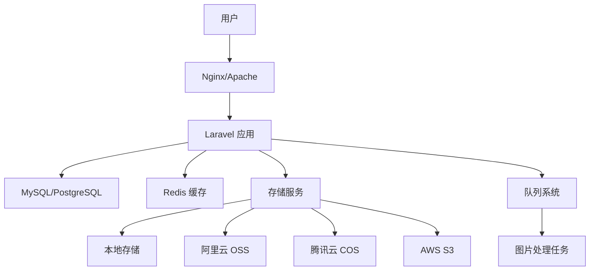

<div align="center">


# PicHub

专业的图片托管与管理平台

[在线演示](https://pichub.app) · [问题反馈](https://github.com/truman-world/PicHub/issues)

</div>

---

<table>
<tr>
<td width="50%" align="center" valign="middle">

<br />

**后端技术**

[](https://laravel.com)
[](https://php.net)
[](https://mysql.com)
[](https://postgresql.org)
[](https://redis.io)

**前端技术**

[](https://tailwindcss.com)
[](https://alpinejs.dev)
[](https://vitejs.dev)
[](https://laravel.com/docs/blade)

**存储服务**

[](https://aliyun.com/product/oss)
[](https://cloud.tencent.com/product/cos)
[](https://qiniu.com)
[](https://aws.amazon.com/s3)

**开发工具**

[](https://docker.com)
[](https://getcomposer.org)
[](https://git-scm.com)
[](https://npmjs.com)

<br />

</td>
</tr>
</table>

---

## 为什么选择 PicHub？

<table>
<tr>
<td width="33%" align="center">

### 高性能

自动图片压缩、缩略图生成、CDN 加速，确保图片加载速度快如闪电。

</td>
<td width="33%" align="center">

### 高安全

企业级权限控制、防盗链、水印保护，全方位保障您的图片安全。

</td>
<td width="33%" align="center">

### 易集成

完整的 RESTful API、多种 SDK，轻松集成到您的应用中。

</td>
</tr>
</table>

---

## 核心功能

### 图片管理

- ✅ **多格式支持** - JPEG、PNG、WebP、GIF、SVG 等主流图片格式
- ✅ **批量上传** - 支持拖拽上传、粘贴上传、批量上传
- ✅ **图片处理** - 自动压缩、格式转换、尺寸调整、水印添加
- ✅ **智能裁剪** - 按比例裁剪、智能识别主体
- ✅ **懒加载** - 提升页面加载速度

### 相册系统

- ✅ **相册管理** - 创建、编辑、删除相册，支持封面设置
- ✅ **分类整理** - 按标签、日期、相册分类管理图片
- ✅ **批量操作** - 批量移动、复制、删除图片
- ✅ **相册分享** - 生成分享链接，支持密码保护
- ✅ **权限控制** - 公开/私有/仅自己可见

### 存储方案

- ✅ **本地存储** - 适合小规模部署
- ✅ **阿里云 OSS** - 高可用、低成本
- ✅ **腾讯云 COS** - 稳定可靠
- ✅ **七牛云** - 快速便捷
- ✅ **AWS S3** - 全球部署
- ✅ **混合存储** - 支持多存储后端并存

### 用户系统

- ✅ **用户认证** - 注册、登录、找回密码、邮箱验证
- ✅ **权限管理** - 基于角色的访问控制（RBAC）
- ✅ **配额管理** - 灵活的存储空间和流量配额
- ✅ **使用统计** - 详细的上传、浏览、流量统计
- ✅ **API 密钥** - 安全的 API 访问凭证管理

### API 接口

- ✅ **RESTful API** - 完整的图片上传、管理、删除接口
- ✅ **API 文档** - 详细的 API 文档和示例代码
- ✅ **认证方式** - 支持 Token、OAuth 2.0
- ✅ **SDK 支持** - 提供多种语言的 SDK
- ✅ **Webhook** - 事件通知和回调

---

## 快速开始

### 环境要求

- PHP >= 8.2
- Composer
- Node.js >= 18.x
- MySQL >= 8.0 或 PostgreSQL >= 13
- Redis （可选，用于缓存和队列）

### 一键安装

```bash
# 1. 克隆项目
git clone https://github.com/truman-world/pichub.git
cd pichub

# 2. 安装依赖
composer install
npm install

# 3. 配置环境
cp .env.example .env
php artisan key:generate

# 4. 配置数据库（编辑 .env 文件）
# DB_CONNECTION=mysql
# DB_HOST=127.0.0.1
# DB_PORT=3306
# DB_DATABASE=pichub
# DB_USERNAME=root
# DB_PASSWORD=

# 5. 运行迁移
php artisan migrate --seed

# 6. 构建前端资源
npm run build

# 7. 启动服务
php artisan serve
```

访问 `http://localhost:8000` 开始使用！

### Docker 部署

```bash
# 使用 Docker Compose 一键部署
docker-compose up -d

# 运行数据库迁移
docker-compose exec app php artisan migrate --seed
```

访问 `http://localhost` 即可使用。

---

## 功能截图

<table>
<tr>
<td width="50%" align="center">

**响应式首页**


</td>
<td width="50%" align="center">

**图片管理**


</td>
</tr>
<tr>
<td width="50%" align="center">

**相册系统**


</td>
<td width="50%" align="center">

**暗色模式**


</td>
</tr>
</table>

---

## 技术架构

### 系统架构



### 目录结构

```
pichub/
├── app/                    # 应用核心代码
│   ├── Http/              # 控制器、中间件、请求
│   ├── Models/            # Eloquent 模型
│   ├── Services/          # 业务逻辑服务
│   └── Jobs/              # 队列任务
├── resources/             # 前端资源
│   ├── views/             # Blade 模板
│   ├── css/               # 样式文件
│   ├── js/                # JavaScript 文件
│   └── lang/              # 多语言文件
├── public/                # 公共资源
├── routes/                # 路由定义
├── database/              # 数据库迁移和种子
├── storage/               # 文件存储
│   ├── app/              # 应用存储
│   ├── logs/             # 日志文件
│   └── framework/        # 框架缓存
├── tests/                 # 单元测试和功能测试
├── docs/                  # 项目文档
└── tools/                 # 开发工具
    ├── analyzers/        # 代码分析工具
    └── scripts/          # 运维脚本
```

---

## 文档

完整的项目文档位于 [`docs/`](docs/) 目录：

### 入门文档

- [文档索引](docs/DOCS_INDEX.md) - 所有文档的导航入口
- [相册快速开始](docs/ALBUM_QUICK_START.md) - 5分钟快速上手相册功能
- [相册功能详解](docs/ALBUM_FEATURES.md) - 相册功能完整说明

### 开发文档

- [Claude 开发规范](CLAUDE.md) - AI 辅助开发规范和最佳实践
- [代码质量审计](docs/code-quality-audit-report.md) - 代码规范和质量要求
- [Controller 审计](docs/controller-audit-summary.md) - 控制器设计规范

### 配置指南

- [数据库迁移](docs/MIGRATION_GUIDE.md) - 数据库升级和迁移指南
- [邮件服务配置](docs/EMAIL_SOLUTIONS.md) - SMTP、SendGrid 等配置
- [DNS 配置指南](docs/dns-fix-guide.md) - 域名解析和SSL配置

### 运维文档

- [问题修复记录](docs/PROJECT_FIXES.md) - Bug 修复和功能更新日志
- [性能优化](docs/database-performance-update.md) - 数据库和缓存优化

---

## 多语言支持

PicHub 支持以下语言：

- 🇨🇳 简体中文
- 🇺🇸 English
- 🇫🇷 Français
- 🇷🇺 Русский

更多语言正在添加中...

---

## 贡献指南

我们欢迎所有形式的贡献！

### 如何贡献

1. **Fork 本项目** - 点击右上角的 Fork 按钮
2. **创建特性分支** - `git checkout -b feature/AmazingFeature`
3. **提交更改** - `git commit -m 'Add some AmazingFeature'`
4. **推送到分支** - `git push origin feature/AmazingFeature`
5. **提交 Pull Request** - 打开 PR 并描述您的更改

### 开发规范

在提交代码前，请确保：

- ✅ 遵循 [PSR-12 编码规范](https://www.php-fig.org/psr/psr-12/)
- ✅ 添加必要的单元测试
- ✅ 更新相关文档
- ✅ 代码通过 PHPStan 和 Pint 检查
- ✅ 遵循 [CLAUDE.md](CLAUDE.md) 中的开发规范

### 报告问题

发现 Bug？请 [提交 Issue](https://github.com/truman-world/pichub/issues) 并包含：

- 问题描述
- 复现步骤
- 预期行为
- 实际行为
- 系统环境信息

---

## 项目统计

<p align="center">
  
  
  
</p>

<p align="center">
  
  
  
  
  
</p>

---

## 许可证

本项目采用 [MIT 许可证](LICENSE)。

这意味着您可以自由地：

- ✅ 商业使用
- ✅ 修改代码
- ✅ 分发代码
- ✅ 私有使用

---

## 联系方式

<table>
<tr>
<td width="50%" align="center">

### 社区支持

- [GitHub Discussions](https://github.com/truman-world/pichub/discussions)
- [Discord 社区](https://discord.gg/pichub)
- [Stack Overflow](https://stackoverflow.com/questions/tagged/pichub)
- [中文论坛](https://forum.pichub.app)

</td>
<td width="50%" align="center">

### 商务合作

- **官方网站**: https://pichub.app
- **邮箱**: contact@pichub.app
- **Twitter**: [@PicHubApp](https://twitter.com/pichubapp)
- **微信**: PicHub官方

</td>
</tr>
</table>

---

## 致谢

感谢以下开源项目和贡献者：

- [Laravel](https://laravel.com) - 优雅的 PHP Web 框架
- [Alpine.js](https://alpinejs.dev) - 轻量级 JavaScript 框架
- [Tailwind CSS](https://tailwindcss.com) - 实用优先的 CSS 框架
- [FilamentPHP](https://filamentphp.com) - 强大的 Laravel 后台面板
- 所有为 PicHub 做出贡献的开发者 ❤️

---

## Star History

[](https://star-history.com/#truman-world/pichub&Date)

---

<p align="center">
  <strong>Made with ❤️ by PicHub Team</strong><br>
  <sub>© 2025 PicHub. All rights reserved.</sub>
</p>

<p align="center">
  <a href="https://pichub.app">官网</a> •
  <a href="https://pichub.app/docs">文档</a> •
  <a href="https://demo.pichub.app">演示</a> •
  <a href="https://github.com/truman-world/pichub/issues">问题反馈</a> •
  <a href="https://twitter.com/pichubapp">Twitter</a>
</p>
